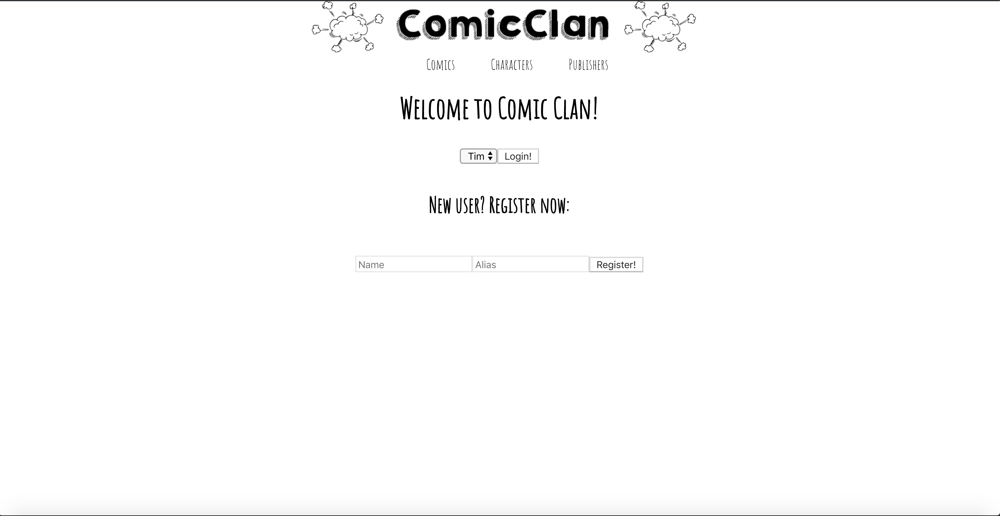
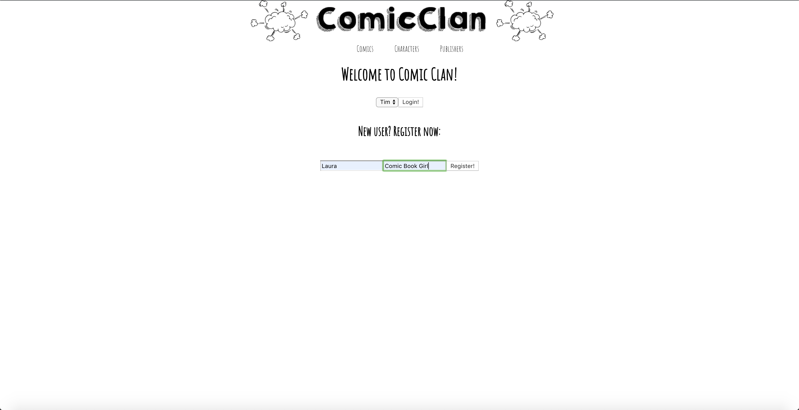
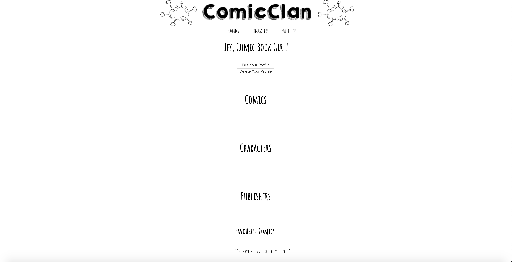
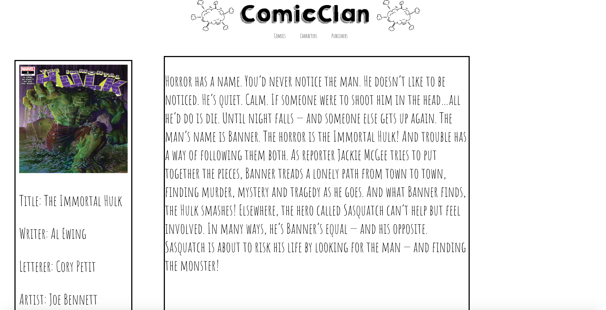
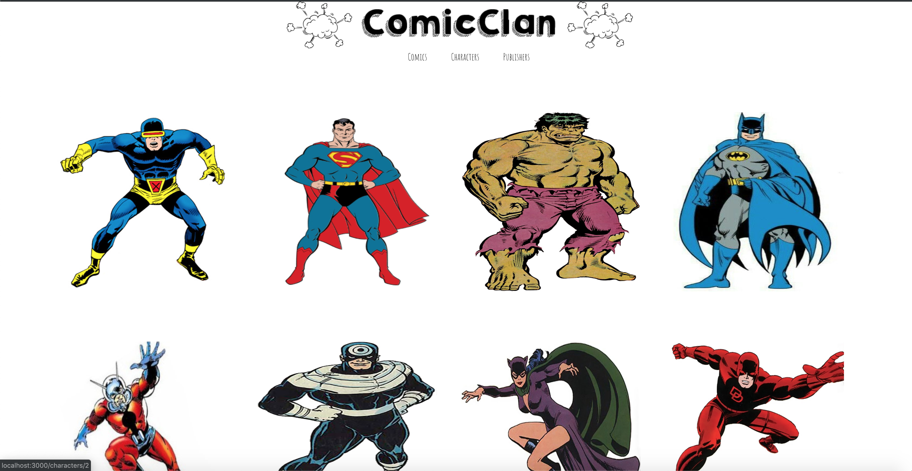
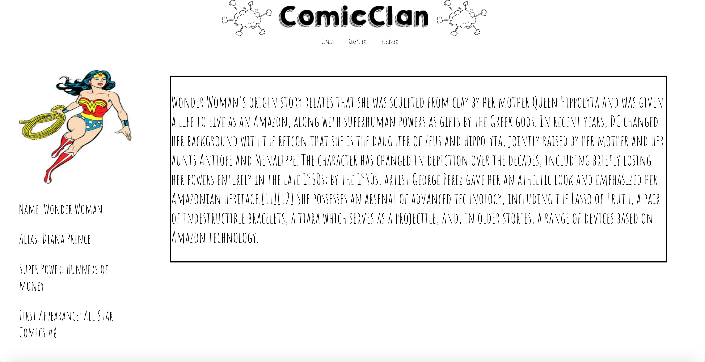
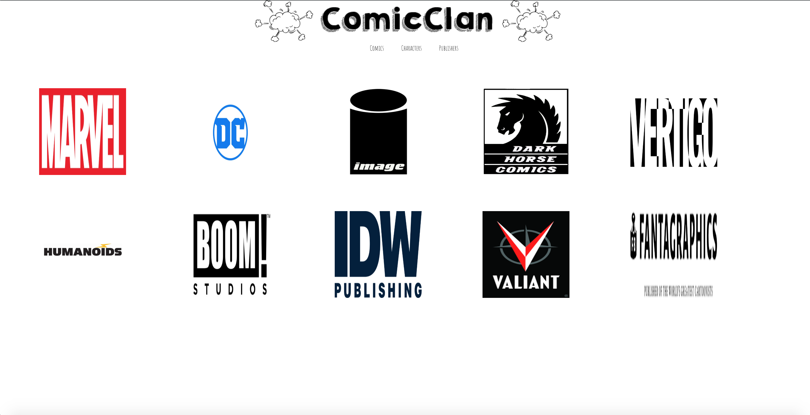

# Group Java Project
#### Database Site for Comics

Group project for CodeClan, this project was built over a period of 6 days with @laurasheach and @shaunhk.

A full stack app using a JavaScript/JSX/React frontend and RESTful API routes to a Java/Spring/Hibernate/PostgreSQL backend. The user profiles have full CRUD functionality.

The information contained in the database for the comics for the app was built ourselves.

## Features

* A user can log-in and view their profile, keeping a unique profile

* A new user can register and log-in to their profile

* A user can update their profile

* A user can delete their profile

* Can view all comics, characters and publishers available in the database

* Can view additional details on a comic

* Can view additional details on a character

## Screenshots

#### Create A New User

#### Profile Page

#### Comic List Page

#### Comic Detail

#### Character List Page

#### Character Detail

#### Publisher Page

